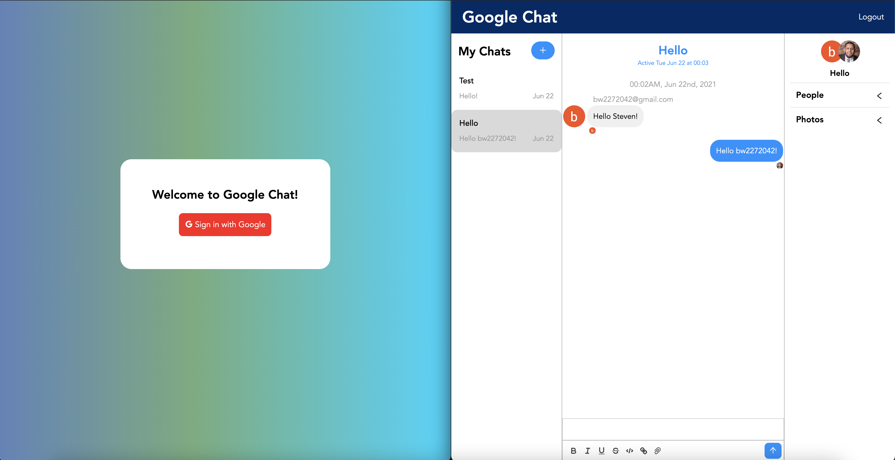

# Mock version of Google Chat 

## Instructions
### Download the files and in the terminal, run npm install, once all the dependencies are installed you can launch the app with npm start. 

### Built with React.js
### Routing
### Social Authorization
### Firebase
### React Context 
### Chat Engine
### Rest API's 
### Environment Varibales.

